# SoyaLens

Auditor visual por IA para control de calidad de soya en Santa Cruz, Bolivia. El sistema recibe una foto de una bandeja de granos, detecta y clasifica cada grano, calcula porcentajes de calidad, aplica descuentos normados y emite un certificado auditable con evidencia fotografica.

Proyecto desarrollado para Build With AI 2026, mencion Industria.

## Equipo

**Nombre del equipo:** SoyaLens

**Integrantes registrados en el historial del repositorio:**
- AlfredoZC
- Pablo Alejandro Osorio Portanda
- Isaac Ezequiel Llanos Terrazas
- Analin Choque Cruz
- Atsushi Adrián Bravo Iriarte

## Problema

En centros de acopio y silos, la calidad de la soya se evalua manualmente separando granos bajo luz artificial. Ese proceso toma tiempo, depende del criterio del tecnico y puede afectar directamente el precio pagado por cada camion. SoyaLens propone una auditoria optica objetiva, rapida y trazable para reducir filas, subjetividad y disputas comerciales.

## Solucion

SoyaLens funciona como un SaaS cloud-first:

1. El operario sube o captura una foto de la muestra.
2. El backend guarda la imagen como evidencia.
3. El modulo de IA detecta granos con YOLO26 y resume la calidad.
4. El agente genera una justificacion de auditoria.
5. El sistema emite un certificado con veredicto, descuento y evidencia.
6. El dashboard muestra historial y metricas del dia.

Clases de grano usadas por el MVP:
- `sano`
- `partido`
- `inmaduro`
- `dañado`

## Arquitectura

```text
Frontend Web
HTML/CSS/JS, modo demo y modo API
        |
        | HTTP / JSON + multipart
        v
Backend FastAPI
POST /api/v1/analyze, historial, metricas, healthcheck
        |
        | llama funciones Python
        v
Modulo IA
YOLO26 + fallback determinista + certificado LLM/fallback
        |
        | evidencia + resultados
        v
Supabase
PostgreSQL samples + Storage bucket evidence
```

Contrato central del proyecto:
- `shared/schemas.py` define los modelos Pydantic compartidos.
- `ai/pipeline.py` expone `detect_grains`, `summarize` y `generate_certificate`.
- `backend/main.py` implementa los endpoints definidos en `PROJECT.md`.

## Tecnologias

| Capa | Tecnologia |
|---|---|
| Backend | FastAPI, Uvicorn, Python 3.12 |
| Vision | Ultralytics YOLO26, PyTorch, OpenCV |
| Entrenamiento | Roboflow dataset, Weights & Biases |
| Certificado IA | Gemini Flash con `google-genai`; fallback local/determinista |
| Base de datos | Supabase PostgreSQL |
| Evidencia | Supabase Storage bucket `evidence` |
| Frontend | HTML, CSS, JavaScript, Chart.js |
| Calidad | Pytest, Ruff |
| Deploy local | Docker Compose |

## Imagenes referenciales

El repositorio incluye imagenes y artefactos reales del entrenamiento/dataset:

**Resultados del entrenamiento YOLO26**

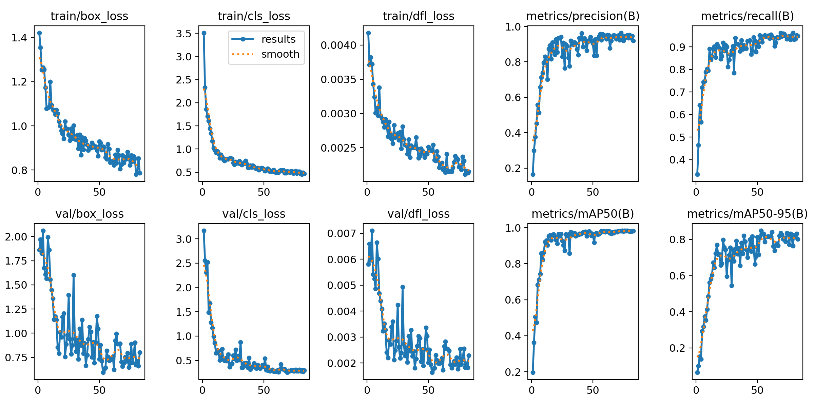

**Curvas de aprendizaje y desempeño**

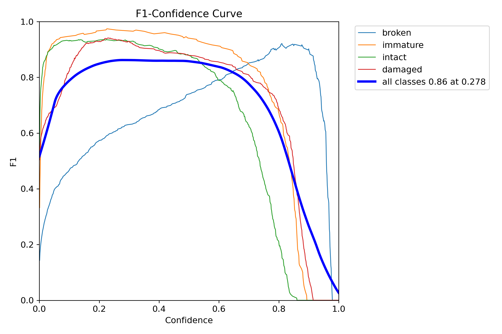
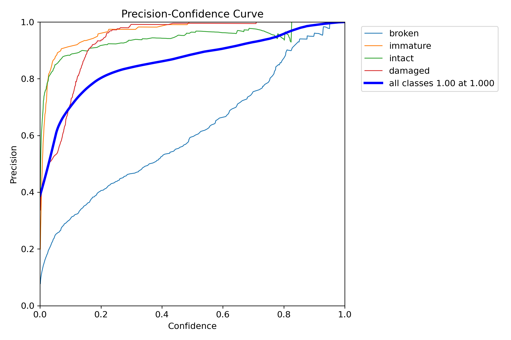
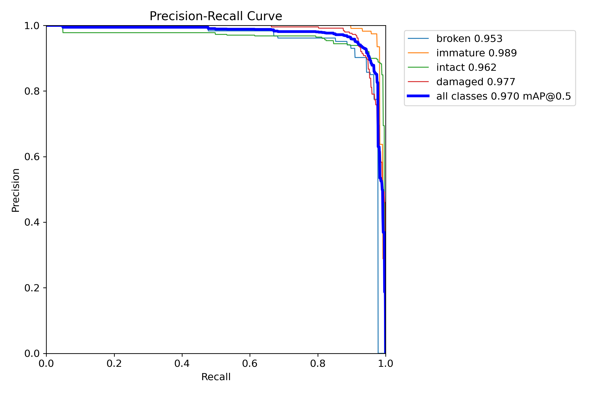
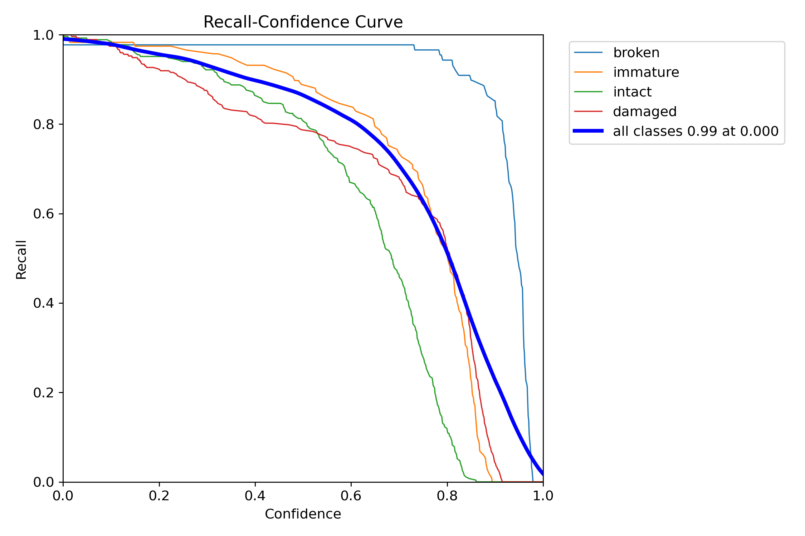

**Matriz de confusion**

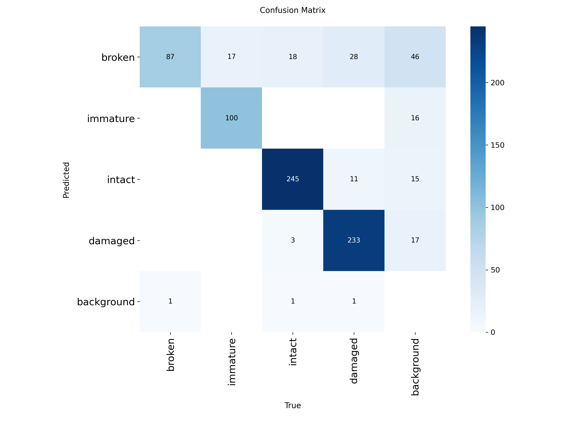
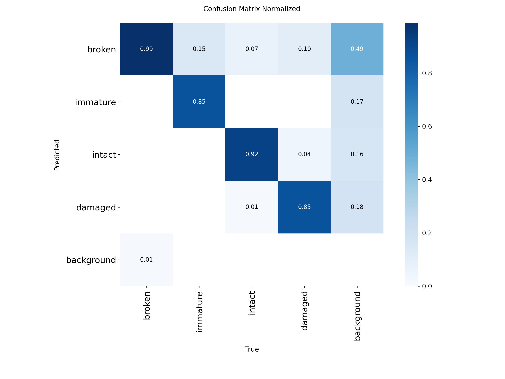

**Predicciones de validacion**

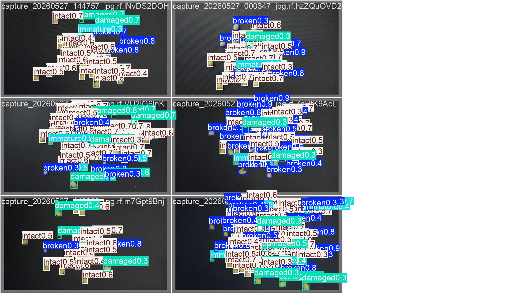
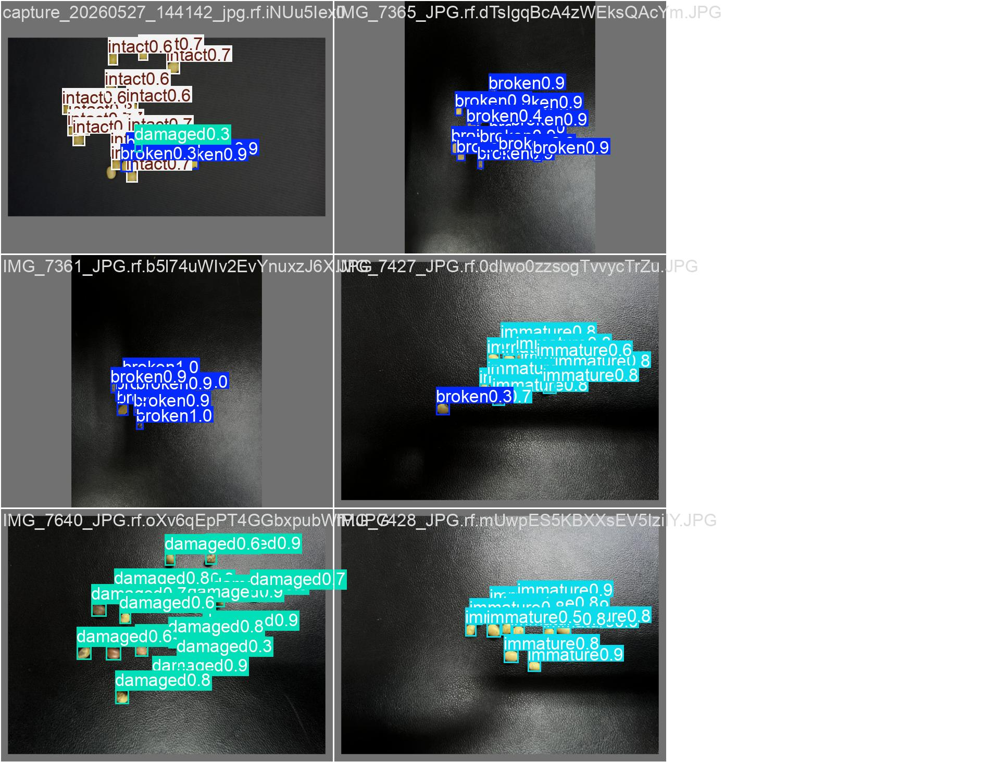
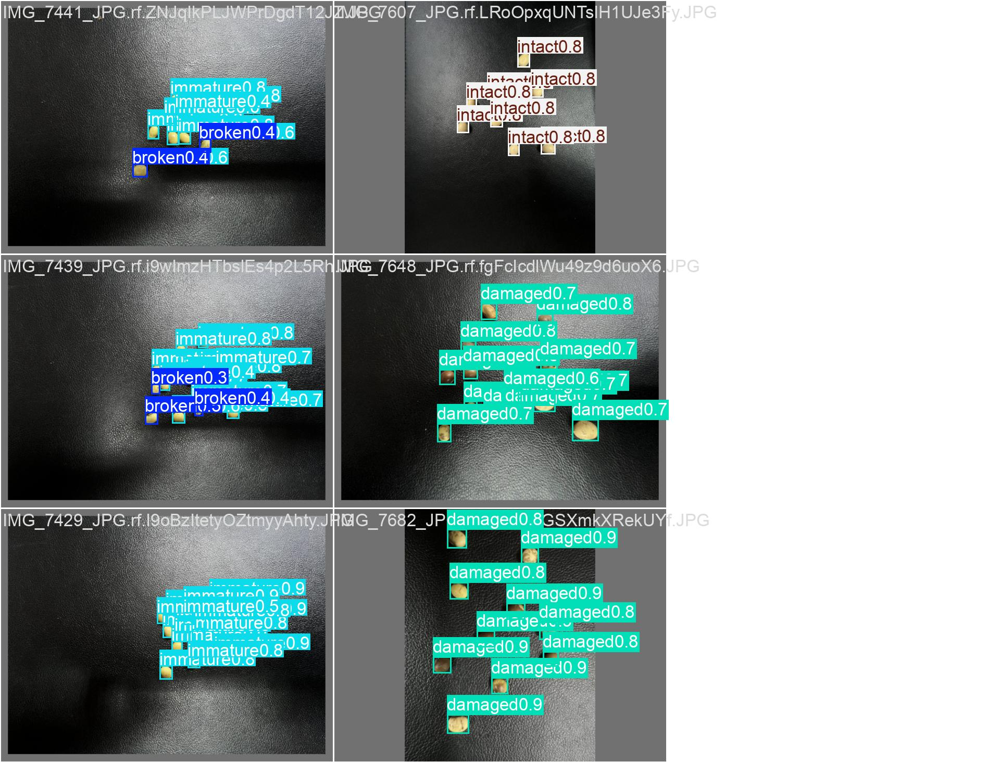

**Distribucion de etiquetas**

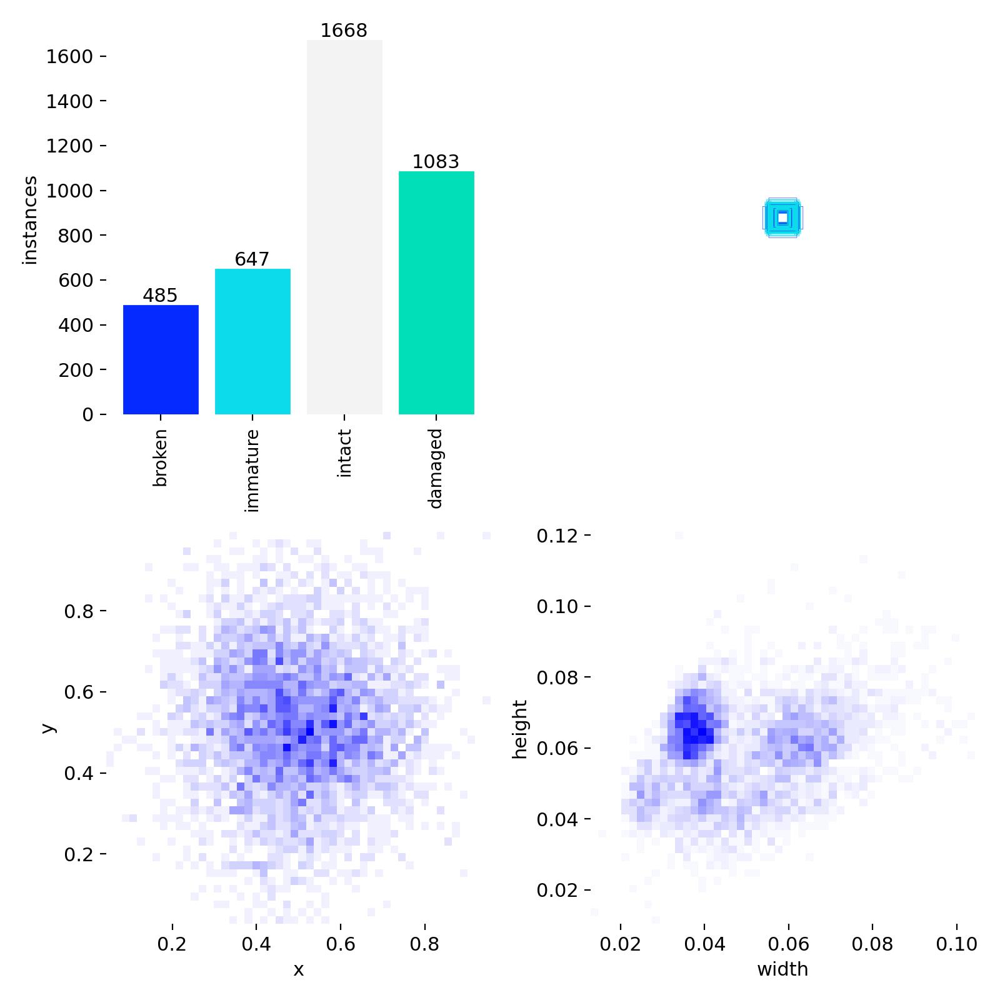

Mas imagenes de prueba: `ai/dataset/smoke_test/images/`.

## Estructura del repositorio

```text
soyaLens/
├── ai/                 # Pipeline IA, descuento, entrenamiento, pesos y dataset
├── backend/            # API FastAPI y acceso a Supabase
├── frontend/           # Interfaz web demo/API
├── shared/             # Schemas Pydantic compartidos
├── tests/              # Smoke tests del backend
├── docs/               # Documentacion viva por componente
├── PROJECT.md          # Documento maestro y contratos del MVP
├── docker-compose.yml  # Servicio backend
└── requirements.txt    # Dependencias Python principales
```

## Configuracion

1. Crear y activar un entorno virtual:

```bash
python -m venv .venv
.venv\Scripts\activate
```

2. Instalar dependencias:

```bash
pip install -r requirements.txt
pip install ultralytics wandb google-genai openai
```

3. Crear `.env` desde `.env.example`:

```bash
copy .env.example .env
```

Variables principales:

```env
SUPABASE_URL=...
SUPABASE_KEY=...
GEMINI_API_KEY=...
WANDB_API_KEY=...
LANGFUSE_PUBLIC_KEY=...
LANGFUSE_SECRET_KEY=...
MODEL_PATH=ai/weights/best.pt
```

4. En Supabase, crear:
- Tabla `samples` segun `PROJECT.md` seccion 5.2.
- Bucket publico `evidence` para imagenes de evidencia.

## Ejecucion local

### Backend

```bash
uvicorn backend.main:app --reload --port 8000
```

Healthcheck:

```bash
curl http://localhost:8000/health
```

### Frontend

```bash
python frontend/server.py
```

Abrir:

```text
http://localhost:8080
```

La interfaz inicia en **Modo Demo** y puede cambiarse a **API Servidor** para consumir `http://localhost:8000`.

### Docker

```bash
docker compose up --build
```

## Endpoints principales

| Metodo | Ruta | Descripcion |
|---|---|---|
| `GET` | `/health` | Estado del backend |
| `POST` | `/api/v1/analyze` | Recibe imagen, analiza muestra y devuelve certificado |
| `GET` | `/api/v1/samples?limit=50` | Lista historial de muestras |
| `GET` | `/api/v1/samples/{id}` | Consulta una muestra por ID |
| `GET` | `/api/v1/stats/today` | Metricas del dia |

## Entrenamiento IA

```bash
python ai/train/train.py
```

Opciones utiles:

```bash
python ai/train/train.py --epochs 80 --batch 8 --device cpu
python ai/train/train.py --no-wandb
```

El mejor checkpoint se copia a:

```text
ai/weights/best.pt
```

## Tests

```bash
python -m pytest tests/test_backend.py -v
```

## Estado actual del MVP

- Backend FastAPI implementado con endpoints principales.
- Pipeline IA conectado con YOLO26 y fallback determinista.
- Modelo entrenado disponible en `ai/weights/best.pt`.
- Frontend web con carga de imagen, certificado, dashboard y modo demo/API.
- Supabase requerido para flujo real de evidencia e historial.

Para decisiones funcionales, contratos de datos y alcance oficial, revisar `PROJECT.md`.
